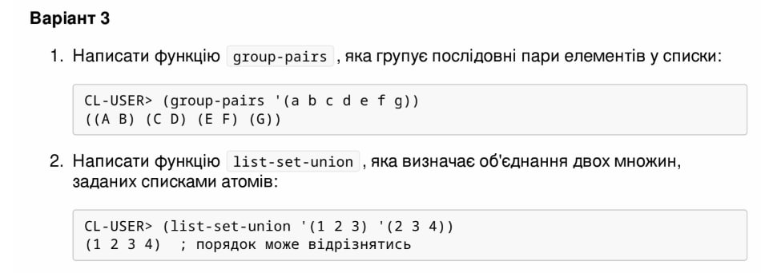

<p align="center"><b>МОНУ НТУУ КПІ ім. Ігоря Сікорського ФПМ СПіСКС</b></p>
<p align="center">
<b>Звіт з лабораторної роботи 2</b><br/>
"Рекурсія"<br/>
дисципліни "Вступ до функціонального програмування"
</p>
<p align="right"><b>Студент</b>: Петрушин Віктор Борисович КВ-12</p>
<p align="right"><b>Рік</b>: 2024</p>

### Загальне завдання  
Реалізуйте дві рекурсивні функції, що виконують деякі дії з вхідним(и) списком(-ами), за
можливості/необхідності використовуючи різні види рекурсії. Функції, які необхідно
реалізувати, задаються варіантом (п. 2.1.1). Вимоги до функцій:
1. Зміна списку згідно із завданням має відбуватись за рахунок конструювання нового
списку, а не зміни наявного (вхідного).
2. Не допускається використання функцій вищого порядку чи стандартних функцій
для роботи зі списками, що не наведені в четвертому розділі навчального
посібника.
3. Реалізована функція не має бути функцією вищого порядку, тобто приймати функції
в якості аргументів.
4. Не допускається використання псевдофункцій (деструктивного підходу).
5. Не допускається використання циклів.
Кожна реалізована функція має бути протестована для різних тестових наборів. Тести
мають бути оформленні у вигляді модульних тестів.

### Варіант №3 (18)

<p align="center">
    
</p>

### Лістинг функції "group-pairs" та тестові набори до неї

```lisp
;; Завдання №1

(defun group-pairs (list1)
"Result pairs: "
(if (null list1)
	nil
(if (= 1 (list-length list1))
	(cons (list (car list1)) nil)
	(cons (list (car list1) (cadr list1))
		(group-pairs (cddr list1))))))

(defun test_func_1 (test_name enter_list expected_result)
(format t "~:[FAILED~;passed~] ~a~%"
          (equal (group-pairs enter_list) expected_result) test_name))

(defun call_test_func_1 ()
(test_func_1 "Test 1.1" '(A B C D E F G) '((A B) (C D) (E F) (G)))
(test_func_1 "Test 1.2" '(A) '((A)))
(test_func_1 "Test 1.3" '() NIL))

(call_test_func_1)
```
### Тестування функції "group-pairs"

```lisp
(call_test_func_1)
passed Test 1.1
passed Test 1.2
passed Test 1.3
```

### Лістинг функції "list-set-union" та тестові набори до неї

```lisp
;; Завдання №2

(defun is-in-list (element list)
(cond
((null list) nil)
((eql (car list) element) t)
(t (is-in-list element (cdr list)))))

(defun list-set-union (list1 list2)
"Result list: "
(cond
((and (null list1) (null list2)) nil)
((null list1) list2)
((null list2) list1)
((is-in-list (car list1) list2)
(list-set-union (cdr list1) list2))
(t (cons (car list1) (list-set-union (cdr list1) list2)))))

(defun test_func_2 (test_name enter_list_1 enter_list_2 expected_result)
(format t "~:[FAILED~;passed~] ~a~%"
          (equal (list-set-union enter_list_1 enter_list_2) expected_result) test_name))

(defun call_test_func_2 ()
(test_func_2 "Test 2.1" '(1 2 3 4) '(3 4 5 6) '(1 2 3 4 5 6))
(test_func_2 "Test 2.2" '(1 2 3 4 5) '() '(1 2 3 4 5))
(test_func_2 "Test 2.3" '() '() NIL))

(call_test_func_2)
```

### Тестування функції "list-set-union"

```lisp
(call_test_func_2)
passed Test 2.1
passed Test 2.2
passed Test 2.3
```

