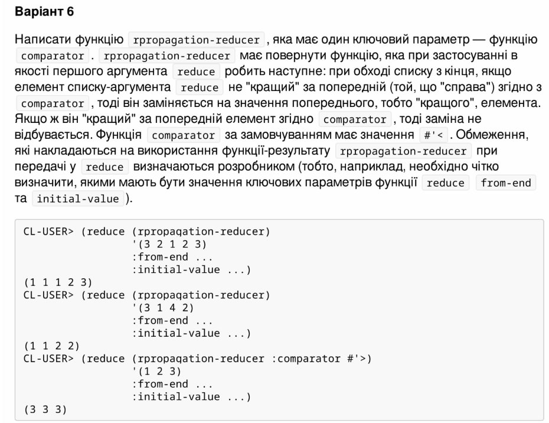

<p align="center"><b>МОНУ НТУУ КПІ ім. Ігоря Сікорського ФПМ СПіСКС</b></p>
<p align="center">
<b>Звіт з лабораторної роботи 4</b><br/>
"Функції вищого порядку та замикання"<br/>
дисципліни "Вступ до функціонального програмування"
</p>
<p align="right"><b>Студент</b>: Петрушин Віктор Борисович КВ-12</p>
<p align="right"><b>Рік</b>: 2024</p>

### Загальне завдання  
Завдання складається з двох частин:
1. Переписати функціональну реалізацію алгоритму сортування з лабораторної
роботи 3 з такими змінами:
використати функції вищого порядку для роботи з послідовностями (де це
доречно);
додати до інтерфейсу функції (та використання в реалізації) два ключових
параметра: key та test , що працюють аналогічно до того, як працюють
параметри з такими назвами в функціях, що працюють з послідовностями. При
цьому key має виконатись мінімальну кількість разів.
2. Реалізувати функцію, що створює замикання, яке працює згідно із завданням за
варіантом (див. п 4.1.2). Використання псевдо-функцій не забороняється, але, за
можливості, має бути мінімізоване.

### 1. Лістинг функції "sort_func" та тестові набори до неї
```lisp
(defun sort-func (lst &key (key #'identity) (test #'>=))
  (labels ((exchange-func (unsorted)
    (if (null (cdr unsorted)) 	; якщо список має 1 або 0 елементів
              unsorted
              (let* ((first (car unsorted))
		       (second (cadr unsorted))
		       (first-key (funcall key first))
                       (second-key (funcall key second)))
                (if (funcall test first-key second-key)  	; якщо перший елемент більший рівний другому 
                    (cons second (exchange-func (cons first (cddr unsorted)))) ; міняємо місцями
                    (cons first (exchange-func (cdr unsorted))))))) ; якщо не треба міняти, просто продовжуємо
           (exchange-rec (lst n)
             (if (< n 2)  	; якщо залишилося менше 2 елементів для перевірки
                 lst
               (exchange-rec (exchange-func lst) (- n 1))))) ; рекурсивно викликаємо з новим списком
  (exchange-rec lst (length lst)))) ; починаємо рекурсію з початкового списку та його довжини


(defun test-func-1 (test-name enter-list expected-result &key (key #'identity) (test #'>=))
  (format t "~:[FAILED~;passed~] ~a~%"
    (equal (sort-func enter-list :key key :test test) expected-result) test-name))

(defun call-test-func-1 ()
  (test-func-1 "Test 1.1" '(5 4 3 2 1) '(1 2 3 4 5))
  (test-func-1 "Test 1.2" '(6 7 7 3 5 5 2 1) '(1 2 3 5 5 6 7 7))
  (test-func-1 "Test 1.3" '(-8 7 -3 -5 5 2 -1) '(-1 2 -3 -5 5 7 -8) :key #'abs)
  (test-func-1 "Test 1.4" '(-8 7 -3 -5 5 2 -1) '(-1 2 -3 -5 5 7 -8) :key #'abs :test #'>)
  (test-func-1 "Test 1.5" '(7) '(7))
  (test-func-1 "Test 1.6" '() NIL))

(call-test-func-1)
```

### Тестування функції "sort_func"
```lisp
passed Test 1.1
passed Test 1.2
passed Test 1.3
passed Test 1.4
passed Test 1.5
passed Test 1.6
```

### Завдання №2 за варіантом №6 (18)
<p align="center">
    
</p>

### Лістинг коду завдання №2
```lisp
(defun rpropagation-reducer (&key (comparator #'<))
  (lambda (element result)
    (if (null result)	; якщо в результаті ще немає жодного елемента
        (list element)
        (if (funcall comparator element (car result))	; якщо поточний елемент "кращий", ніж попередній
            (cons element result)	; додаємо до результату поточний елемент
            (cons (car result) result)))))	; якщо не "кращий" - дублюємо попередній елемент

(defun call-rpropagation-reducer (enter-list &key comparator)	; функція для виклику з конкретними значеннями ключових парамерів 
  (reduce (rpropagation-reducer :comparator comparator) enter-list :initial-value '() :from-end t))
```

### Тестові набори до функції
```lisp
(defun call-test-func-2 ()
  (test-func-2 "Test 2.1" '(3 2 1 2 3) '(1 1 1 2 3))
  (test-func-2 "Test 2.2" '(3 1 4 2) '(1 1 2 2))
  (test-func-2 "Test 2.3" '(1 5 7) '(7 7 7) :comparator #'>)
  (test-func-2 "Test 2.4" '(7 7 7) '(7 7 7))
  (test-func-2 "Test 2.5" '(7) '(7))
  (test-func-2 "Test 2.6" '(1 2 3 7) '(7 7 7 7) :comparator #'=)
  (test-func-2 "Test 2.7" '() nil))
```

### Тестування функції
```lisp
passed Test 2.1
passed Test 2.2
passed Test 2.3
passed Test 2.4
passed Test 2.5
passed Test 2.6
passed Test 2.7
```


