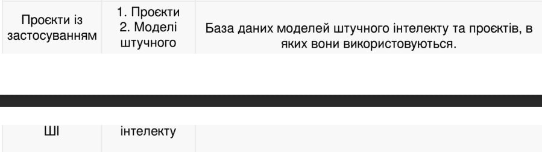

<p align="center"><b>МОНУ НТУУ КПІ ім. Ігоря Сікорського ФПМ СПіСКС</b></p>
<p align="center">
<b>Звіт з лабораторної роботи 5</b><br/>
"Робота з базою даних"<br/>
дисципліни "Вступ до функціонального програмування"
</p>
<p align="right"><b>Студент</b>: Петрушин Віктор Борисович КВ-12</p>
<p align="right"><b>Рік</b>: 2024</p>

### Загальне завдання  
В роботі необхідно реалізувати утиліти для роботи з базою даних, заданою за варіантом
(п. 5.1.1). База даних складається з кількох таблиць. Таблиці представлені у вигляді CSV
файлів. При зчитуванні записів з таблиць, кожен запис має бути представлений певним
типом в залежності від варіанту: структурою, асоціативним списком або геш-таблицею.
1. Визначити структури або утиліти для створення записів з таблиць (в залежності від
типу записів, заданого варіантом).
2. Розробити утиліту(-и) для зчитування таблиць з файлів.
3. Розробити функцію select , яка отримує на вхід шлях до файлу з таблицею, а
також якийсь об'єкт, який дасть змогу зчитати записи конкретного типу або
структури. Це може бути ключ, список з якоюсь допоміжною інформацією, функція і
т. і. За потреби параметрів може бути кілька. select повертає лямбда-вираз,
який, в разі виклику, виконує "вибірку" записів з таблиці, шлях до якої було
передано у select . При цьому лямбда-вираз в якості ключових параметрів може
отримати на вхід значення полів записів таблиці, для того щоб обмежити вибірку
лише заданими значеннями (виконати фільтрування). Вибірка повертається у
вигляді списку записів.
4. Написати утиліту(-и) для запису вибірки (списку записів) у файл.

5. Написати функції для конвертування записів у інший тип (в залежності від
варіанту):
структури у геш-таблиці
геш-таблиці у асоціативні списки
асоціативні списки у геш-таблиці

6. Написати функцію(-ї) для "красивого" виводу записів таблиці.

### Завдання за варіантом №6 (18)
<p align="center">
    
</p>
<p align="center">
    
</p>

### Лістинг реалізації завдання
```lisp
; Оголошення ключів для проектів і моделей
(defvar *project-keys*
  '(:id :project-name :start-date :project-manager :description))

(defvar *ai-model-keys*
  '(:id :ai-model-name :creation-date :intelligence-level :description))

; Функція для очищення рядків від пробілів, табуляцій та нових рядків
(defun clean-string (str)
  (string-trim '(#\Space #\Tab #\Newline #\Return) str))

; Функція для розбиття рядка на частини
(defun line-to-parts (line)
  (let ((start 0)  	; Початкова позиція
        (result nil))  	; Результуючий список
    (loop for sep = (position #\, line :start start)  ; Знаходимо позицію наступної коми
          while sep
          do (push (clean-string (subseq line start sep)) result)  	; Додаємо частину до списку
             (setf start (1+ sep)))  					; Зсуваємо початкову позицію
    (push (clean-string (subseq line start)) result)  			; Додаємо останню частину
    (nreverse result)))  				; Повертаємо список у правильному порядку

; Функція для перетворення рядка на асоціативний список за шаблоном keys
(defun line-to-record (line keys)
  (let ((parts (line-to-parts line)))  	; Розбиваємо рядок на частини
    (loop for key in keys  		; Ітеруємося по ключах
          for value in parts  		; Ітеруємся по значеннях
          collect (cons key value))))  	; Створюємо пари ключ-значення

; Функція для зчитування таблиць з CSV-файлу
(defun read-csv (file-path keys)
  (with-open-file (stream file-path)  	; Відкриваємо файл для читання
    (loop for line = (read-line stream nil)  ; Зчитуємо кожен рядок
          while line  			; Поки рядки не закінчились
          collect (line-to-record line keys))))  ; Перетворюємо рядки на записи

; Функція для виведення асоціативних списків у вигляді таблиці
(defun print-table (records keys) 
  (let ((headers (mapcar (lambda (key) (string-upcase (symbol-name key))) keys))  ; Заголовки таблиці
        (rows (mapcar (lambda (record)  	; Для кожного запису в списку records
                        (mapcar (lambda (key) 	; Для кожного ключа в списку keys
                                  (let ((value (cdr (assoc key record))))  	; Отримуємо значення для поточного ключа в записі
                                    (if value (princ-to-string value) "")))  	; Якщо значення є, перетворюємо його на рядок
                                keys)) 		; Для кожного ключа виконуємо перетворення значення
                      records))) 		; Рухаємось по всіх записах у списку records
    (format t "~{~a~^ | ~}~%" headers)
    (format t "~{~a~^~}~%" (make-list (length headers) :initial-element "----------------"))
    (dolist (row rows)
      (format t "~{~a~^ | ~}~%" row))
    (format t "~{~a~^~}~%" (make-list (length headers) :initial-element "----------------"))
    (format t "~%")))

; Функція для вибірки записів з файлу
(defun select (file-path keys &optional filters)
  (let ((records (read-csv file-path keys)))  	; Зчитуємо всі записи з CSV-файлу, перетворюючи їх на асоціативні списки
    (if (not filters)  				; Якщо фільтри не задано
        records  			; Повтертаємо всі записи, без фільтрації
        (remove-if-not  		; Якщо фільтри є, то використовуєм функцію remove-if-not для фільтрації записів
         (lambda (record)  		; Для всіх записів
           (every (lambda (filter)  	; Застосовуємо кожен фільтр
                    (let ((key (car filter))  	; Отримуємо ключ фільтра
                          (value (cdr filter))) ; Отримуємо значення фільтру
                      (equal (cdr (assoc key record)) value)))  	; Перевіряємо чи значення по даному ключу в записі співпадає з фільтром
                  filters))
         records))))  		; Повертаємо записи які відповідають усім фільтрам

; Функція для запису асоціативних списків у CSV-файл
(defun write-csv (file-path records keys)
  (with-open-file (stream file-path :direction :output :if-exists :overwrite :element-type 'character)  ; Відкриваємо файл для запису
    (dolist (record records)  		; Ітеруємось по кожному запису в списку records
      (format stream "~{~a~^,~}~%"  
              (mapcar (lambda (key)  	; Для кожного ключа зі списку кейс
                        (let ((value (cdr (assoc key record))))  	; Отримуємо значення, яке відповідає ключу в записі
                          (if value (princ-to-string value) "")))  	; Якщо значення є - перетворюємо його в рядок
                      keys)))))  	; Для кожного запису проходимось по всіх ключах


; Функція для перетворення асоціативного списку в хеш-таблицю
(defun alist-to-hash-table (alist)
  (let ((hash (make-hash-table :test 'equal)))  	; Створюємо нову хеш-таблицю
    (dolist (pair alist)  				; Ітеруємось по всіх елементах списку
      (setf (gethash (car pair) hash) (cdr pair)))  	; Додаємо пари ключ-значення в таблицю
    hash))		; Повертаємо хеш-таблицю
```

### Тестові набори та утиліти
```lisp
(defun test-print-table (file-path keys)
  (let ((records (read-csv file-path keys)))
    (print-table records keys)))

(defun test-alist-to-hash-table ()
  (let* ((alist '((:id . 1)
                  (:ai-model-name . "Tasco")
                  (:creation-date . "10-08-2019")
                  (:intelligence-level . "Medium")
                  (:description . "AI bot for researching info")))
         (hash-table (alist-to-hash-table alist)))
    (format t "~%Alist: ~a~%" alist)
    (format t "~%Hash table:~%")
    (maphash (lambda (key value) 	; Ітеруємось по всіх елементах хеш-таблиці
               (format t "~a => ~a~%" key value))
             hash-table)))	; Хеш-таблиця, по якій ми ітеруємось

(format t "~%Reading and output Projects table from file:~%")
(test-print-table "D:/fp_lab5/Projects-table.csv" *project-keys*)

(format t "Reading and output AI-Models table from file:~%")
(test-print-table "D:/fp_lab5/AI-Models-table.csv" *ai-model-keys*)

(format t "Select function using output:~%")
(let ((filtered-records (select "D:/fp_lab5/AI-Models-table.csv" *ai-model-keys* '((:intelligence-level . "High")))))
  (print-table filtered-records *ai-model-keys*))

(format t "Select function using and writing results in file successfully!~%")
(let ((filtered-records (select "D:/fp_lab5/Projects-table.csv" *project-keys* '((:start-date . "05-05-2024")))))
  (write-csv "D:/fp_lab5/Projects-filtered.csv" filtered-records *project-keys*))

(format t "~%Converting alist to hash-table:~%")
(test-alist-to-hash-table)
```

### Тестування
```lisp
Reading and output Projects table from file:
ID | PROJECT-NAME | START-DATE | PROJECT-MANAGER | DESCRIPTION
--------------------------------------------------------------------------------
1 | Chrono1 | 12-10-2023 | Philip Mile | AI using project
2 | Global line | 06-08-2022 | Tony Endrues | Bot integration in manufaturing
3 | Aestic | 05-05-2024 | Jack Monro | Crypto exchange company
4 | GTS Turbo | 05-05-2024 | Devid Ferbs | Porshe 911 autopilot
5 | NemoX | 01-03-2024 | Sergii Maistruk | Learning fishes in Atlantic ocean
--------------------------------------------------------------------------------

Reading and output AI-Models table from file:
ID | AI-MODEL-NAME | CREATION-DATE | INTELLIGENCE-LEVEL | DESCRIPTION
--------------------------------------------------------------------------------
1 | Tasco | 10-08-2019 | Medium | AI bot for researching info
2 | Forte prus | 27-06-2018 | High | Machine learning code
3 | Micro mind | 19-12-2019 | High | Autopilot premium intelect
--------------------------------------------------------------------------------

Select function using output:
ID | AI-MODEL-NAME | CREATION-DATE | INTELLIGENCE-LEVEL | DESCRIPTION
--------------------------------------------------------------------------------
2 | Forte prus | 27-06-2018 | High | Machine learning code
3 | Micro mind | 19-12-2019 | High | Autopilot premium intelect
--------------------------------------------------------------------------------

Select function using and writing results in file successfully!

Converting alist to hash-table:

Alist: ((ID . 1) (AI-MODEL-NAME . Tasco) (CREATION-DATE . 10-08-2019)
        (INTELLIGENCE-LEVEL . Medium)
        (DESCRIPTION . AI bot for researching info))

Hash table:
ID => 1
AI-MODEL-NAME => Tasco
CREATION-DATE => 10-08-2019
INTELLIGENCE-LEVEL => Medium
DESCRIPTION => AI bot for researching info
NIL
```
